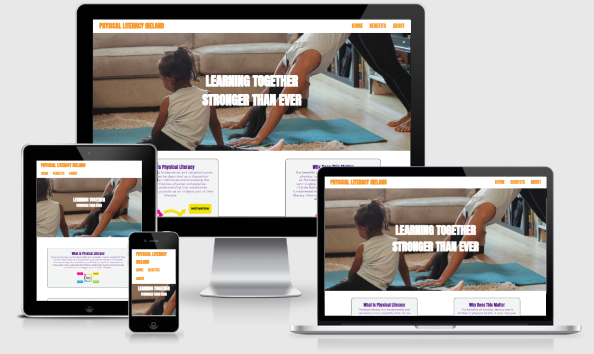

# Physical Literacy Ireland

Physical Literacy Ireland is a website intened to be an information point mainly aimed at parents showing the importance of physical literacy in leading a healthy life.

Users can find out basic information about Physical literacy and it's benefits and also submit to the author for suggestions on how to become more physicaly literate.

## Features

### -Navigation

    - A navigation bar with three clickable links on the right hand side of all pages (these are moved to the left on smaller devices)
    - A "logo" in the left corner which when clicked links to the home page
    - The navigation is intended to mimic a standard format for ease of use by the user

### - Standard page formatting (Header and main images)
    - The header font was chosen using Adobe kuler to match with the Physical literacy graphics used
    - Each page features a different main image with an tag line intended to represent the page's content
    - The images were all chosen from Pexels and represent physical activity 

! [standard-page-formatting] (screenshots-readme/Standardpage.PNG)

### - About and Benefits page structure
    - Both pages are divided into three sections; main image followed by 2 subsequent sections
    - The about page is intended to define what Physical Literacy is and give the user a video to help extend their knowledge
    - The Benefits page is intended to show the physical and mental benefits of being physicaly active. 
    - Across all pages I have used images of multiple age atheletes to convey that physical literacy is a life long pursuit.

! [about-structure] (screenshots-readme/About-structure.PNG)

### - The Home page 
    - The home page features 2 clickable internal links which send the user to the about and Benefits pages.
    - The home page also features a second background image which is intended to draw the user into wanting to know more
    - There is a form for contacting the site owner (the form is not currently active and this is somthing that I would add in at a later date if still working on this project)

! [clickable-links] (screenshots-readme/Clickableinternal links.PNG)

### - The Form
    - The Form consits of 4 elements first name, last name, number of kids and email.
    - The site was intended to be aimed at parents and the form is to get in touch with someone to help you get the best program for your lifestyle

! [form-and-footer] (screenshots-readme/Form-footer.PNG)

### - The Footer
    - The Footer consits of contact information and social media links
    - The footer colour was chosen to match the header text

### - Testing
    - I tested the browser in Chrome and Firefox
    - I tested the responsive elements of the site using the chrome development tools and ensured that it functions well across multiple screen sizes
    - The form requirement elements were checked to ensure that all working
    - I checked that all clickable links internally open in the same window and externally open in new tabs

## - Validator testing
### - HTML
    - There were a few html errors upon my first test
    - These were fixed using the W3C validator reccomendation
    - Examples of these were using an <a> tag as part of an unordered list without it being added as a list item.

### - CSS
    - There was one common error when CSS was validated
    - These were fixed using the jigsaw validator reccomendation
    - The CSS issue found was that a closing } or ; was not found in 3 instances

### - Lighthouse 
    - I performed a lighthouse test on both the desktop and mobile level
    - Both showed good levels of accesibility, seo and best practices
    - The results can be seen below 

#### Desktop
![desktop-lighthouse-test] (screenshots-readme/Lighthouse-desktop.PNG)

#### Mobile 
![mobile-lighthouse-test] (screenshots-readme/Lighthouse-mobile.PNG)

## Unfixed bugs
    - The form does not actually link to anywhere at present
    - The 2 clickable containers on the index page do not scale perfectly when resized, however they are equal on most standard screensizes at full screen

## Credits
 ### - Content index page
    - The quote on the index page is taken from the HSE website ( https://www.hse.ie/eng/about/who/healthwellbeing/our-priority-programmes/heal/physical-activity-guidelines/)
    - The Physical literacy defintion is taken from Wikipedia (https://en.wikipedia.org/wiki/Physical_literacy#:~:text=Physical%20literacy%20is%20a%20fundamental,integral%20part%20of%20their%20lifestyle.)
    - The benfits text is taken from activeforlife.com (https://activeforlife.com/intro-to-physical-literacy/)

### - Content Definitions page
    - The Physical literacy Defintion is taken from (The International Physical Literacy Association, May 2014)
    - The Youtube video can be found at (https://www.youtube.com/embed/ACJN_S3oWTE)

### - Content Benfits page
    - The mental benefits of exercise were taken from ( https://appliedsportpsych.org/resources/health-fitness-resources/psychological-benefits-of-exercise/)
    - The Physical Benefits of exercise were taken from ( https://www.cdc.gov/physicalactivity/basics/pa-health/index.htm)

### - Media 
    - The image used in the what is section is taken from (https://kiddo.edu.au/library/what-physical-literacy)
    - The image used in the why section is taken from (https://kiddo.edu.au/library/australian-physical-literacy-framework)
### - Footer
    - The structure used for the social media links was adapted from the CI LOVE Running Project